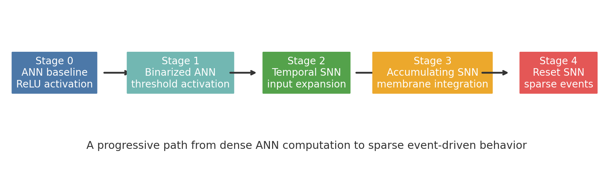
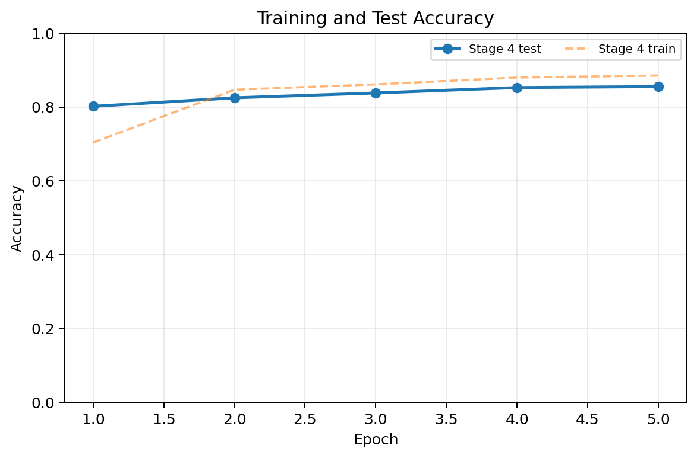
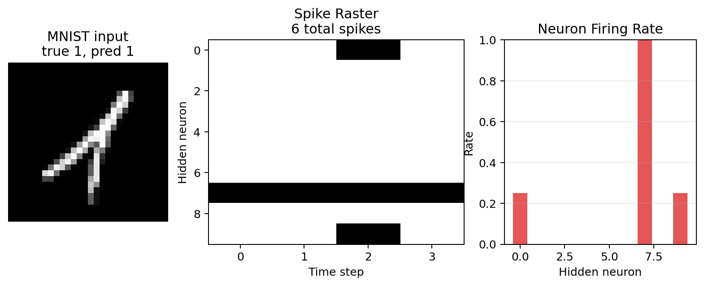
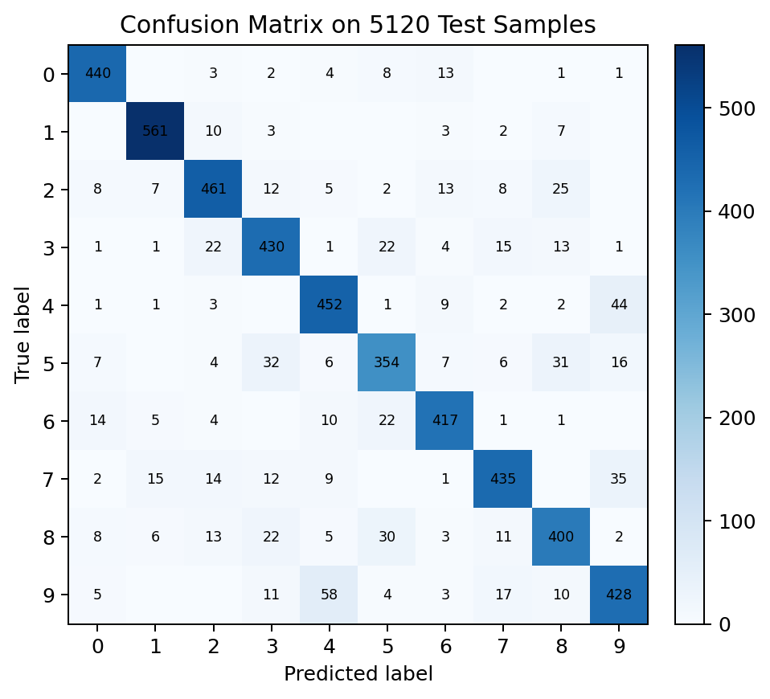

# SNN Structural Evolution Toolkit

[](https://github.com/Scophield/snn-structural-evolution/actions/workflows/ci.yml)
[](LICENSE)


**Build high-accuracy SNNs from scratch while seeing every structural step from ANN to event-driven spikes.**

A minimal PyTorch toolkit for structural evolution from ANN to event-driven SNN for hardware-aware neuromorphic computing.

Unlike monolithic SNN demos, this repository exposes each transformation: activation binarization, temporal execution, membrane accumulation, reset behavior, spike sparsity, and event-operation cost.

Run a 30-second smoke check:

```bash
python -m pip install -r requirements.txt
python train.py --stage 4 --epochs 1 --dry-run
```



## Overview

The project is organized around a five-step structural evolution path:

```text
Stage 0: ANN baseline
   |
   v
Stage 1: activation binarization
   |
   v
Stage 2: temporal expansion
   |
   v
Stage 3: membrane accumulation
   |
   v
Stage 4: reset-based sparse event-driven SNN
```

| Stage | Model | Key idea | Time steps |
| ---: | --- | --- | ---: |
| 0 | ANN baseline | ReLU hidden activation | 1 |
| 1 | Binarized ANN | Threshold activation with surrogate gradient | 1 |
| 2 | Temporal SNN | Repeat inputs over simulation time | configurable |
| 3 | Accumulating SNN | Integrate membrane potential over time | configurable |
| 4 | Reset SNN | Reset membrane after spikes for sparse event behavior | configurable |

## Quick Start

Requirements:

- Python 3.9+
- PyTorch 1.12+

```bash
git clone https://github.com/Scophield/snn-structural-evolution.git
cd snn-structural-evolution
python -m pip install -r requirements.txt
python train.py --stage 4 --dataset mnist --epochs 100
```

For a fast smoke run:

```bash
python train.py --stage 4 --epochs 1 --dry-run
```

To compare all stages quickly:

```bash
python examples/compare_stages.py --epochs 1 --max-train-batches 40 --max-test-batches 40
```

## Reproduce MNIST Experiments

Run each stage with the same training settings:

```bash
python train.py --stage 0 --epochs 100 --batch-size 64 --lr 0.005
python train.py --stage 1 --epochs 100 --batch-size 64 --lr 0.005
python train.py --stage 2 --epochs 100 --batch-size 64 --lr 0.005 --time-steps 4
python train.py --stage 3 --epochs 100 --batch-size 64 --lr 0.005 --time-steps 4
python train.py --stage 4 --epochs 100 --batch-size 64 --lr 0.005 --time-steps 4
```

You can also start from the provided config:

```bash
python train.py --config configs/mnist_stage4.yaml
```

The default data path is `./data`, and the default output path is `./runs`. CUDA is used automatically when available; otherwise training falls back to CPU.

## Configs

Two MNIST configs are provided:

| Config | Purpose | Hidden dim | Notes |
| --- | --- | ---: | --- |
| `configs/mnist_tiny.yaml` | Understand the structural path quickly | 10 | teaching and smoke experiments |
| `configs/mnist_release.yaml` | Accuracy-oriented benchmarking | 128 | use for release-quality runs |

The tiny config keeps the model intentionally small so each structural transformation is easy to inspect. The release config is the recommended starting point for stronger MNIST benchmarks.

## Results on MNIST

Full Stage 0-4 benchmark with `hidden_dim=128`, 100 epochs, full MNIST train/test batches, seed 35, and 4 time steps for temporal stages.

| Stage | Description | Train accuracy | Test accuracy | Time steps | Spike rate | Sparsity | Event ops proxy |
| ---: | --- | ---: | ---: | ---: | ---: | ---: | ---: |
| 0 | ANN baseline | 99.80% | 97.91% | 1 | - | - | - |
| 1 | Binarized activation | 99.24% | 97.09% | 1 | - | - | - |
| 2 | Temporal expansion | 99.22% | 97.27% | 4 | 34.83% | 65.17% | 17,833,800 |
| 3 | Membrane accumulation | 99.06% | 97.41% | 4 | 40.00% | 60.00% | 20,481,800 |
| 4 | Reset-based sparse SNN | 99.25% | 97.24% | 4 | 25.79% | 74.21% | 13,206,980 |

Stage 4 keeps high MNIST accuracy while producing the sparsest event activity among the temporal stages.

Reproducibility snapshot:

| Item | Value |
| --- | --- |
| Exact command | `python examples/compare_stages.py --epochs 100 --hidden-dim 128 --batch-size 64 --lr 0.005 --seed 35 --max-train-batches 938 --max-test-batches 157 --time-steps 4 --data-dir ./data --output-csv runs/release/compare_stages_release.csv` |
| Environment | Python 3.9.13, PyTorch 1.12.0, CUDA, Quadro P620 |
| Runtime | about 1 h 41 min |
| Expected accuracy range | Stage 4 test accuracy should be around 97.0%-98.0% with the release settings |
| Raw results | [docs/results/mnist_release_hidden128_full_20260608.csv](docs/results/mnist_release_hidden128_full_20260608.csv) |
| Reference checkpoint | [stage4_mnist_hidden128_seed35_v0.1.1.pt](https://github.com/Scophield/snn-structural-evolution/releases/download/v0.1.1/stage4_mnist_hidden128_seed35_v0.1.1.pt) |

Regenerate the benchmark with:

```bash
python examples/compare_stages.py --epochs 100 --hidden-dim 128 --batch-size 64 --lr 0.005 --seed 35 --max-train-batches 938 --max-test-batches 157 --time-steps 4 --data-dir ./data --output-csv runs/release/compare_stages_release.csv
```

Raw CSV: [docs/results/mnist_release_hidden128_full_20260608.csv](docs/results/mnist_release_hidden128_full_20260608.csv)

Reference Stage 4 weights are distributed as release assets and reach 97.75% best test accuracy. The Stage 0-4 table above is the final-epoch comparison from `examples/compare_stages.py`; the checkpoint is the best standalone Stage 4 model from `train.py`. See [docs/weights.md](docs/weights.md).

## Why This Is Useful For Hardware Researchers

Unlike black-box SNN training code, this toolkit exposes each structural transformation: activation precision, temporal execution, membrane state, reset behavior, spike sparsity, and event-operation cost.

That makes it useful for studying how ANN computation becomes sparse event-driven behavior for neuromorphic hardware, compute-in-memory accelerators, ReRAM, and analog AI systems.

## Evidence Figures

The repository includes figure-generation tooling for visual evidence:

```bash
python train.py --stage 4 --epochs 100 --metrics-csv runs/stage4_metrics.csv
python scripts/make_figures.py --metrics runs/stage4_metrics.csv --checkpoint runs/stage4_best.pt
```

The checked-in gallery is generated from a short Stage 4 run so the repository has visual evidence immediately. Regenerate it after full training before reporting final benchmark claims.

Training curves:



Stage 4 spike activity:



Stage 4 confusion matrix:



## Project Layout

```text
snn-structural-evolution/
|-- train.py
|-- configs/
|   `-- mnist_stage4.yaml
|-- docs/
|   |-- benchmark.md
|   |-- hardware_relevance.md
|   `-- structural_evolution.md
|-- examples/
|   |-- compare_stages.py
|   |-- export_spike_statistics.py
|   `-- run_mnist.py
|-- scripts/
|   `-- make_figures.py
|-- snn_structural_evolution/
|   |-- data.py
|   |-- metrics.py
|   |-- models.py
|   |-- stages.py
|   |-- surrogate.py
|   `-- training.py
`-- tests/
    `-- test_stages.py
```

## Python API

```python
import torch

from snn_structural_evolution import get_model

model = get_model(stage=4, time_steps=4)
images = torch.rand(8, 1, 28, 28)
logits = model(images)
print(logits.shape)
```

## Research Scope

This repository is intentionally small. Its value is to make the ANN-to-SNN transition explicit and reproducible:

- Stage-level comparison under one training loop
- Surrogate-gradient spike activation
- Device-agnostic CPU/CUDA execution
- Reproducible MNIST data path and CLI arguments
- Reset-based sparse event-driven behavior for hardware-aware studies

More background:

- [Structural evolution](docs/structural_evolution.md)
- [Hardware relevance](docs/hardware_relevance.md)
- [Benchmark notes](docs/benchmark.md)
- [Reference weights](docs/weights.md)
- [FAQ](docs/faq.md)

## Development

Run smoke tests before opening a pull request:

```bash
python -m compileall snn_structural_evolution train.py core.py scripts/make_figures.py
python -m unittest discover tests
```

Legacy source from the initial single-file prototype is kept in `legacy/original_simple_snn_ann.py.txt` for reference.
